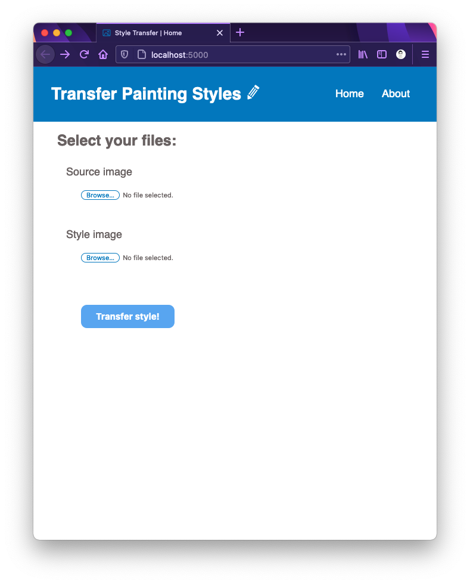
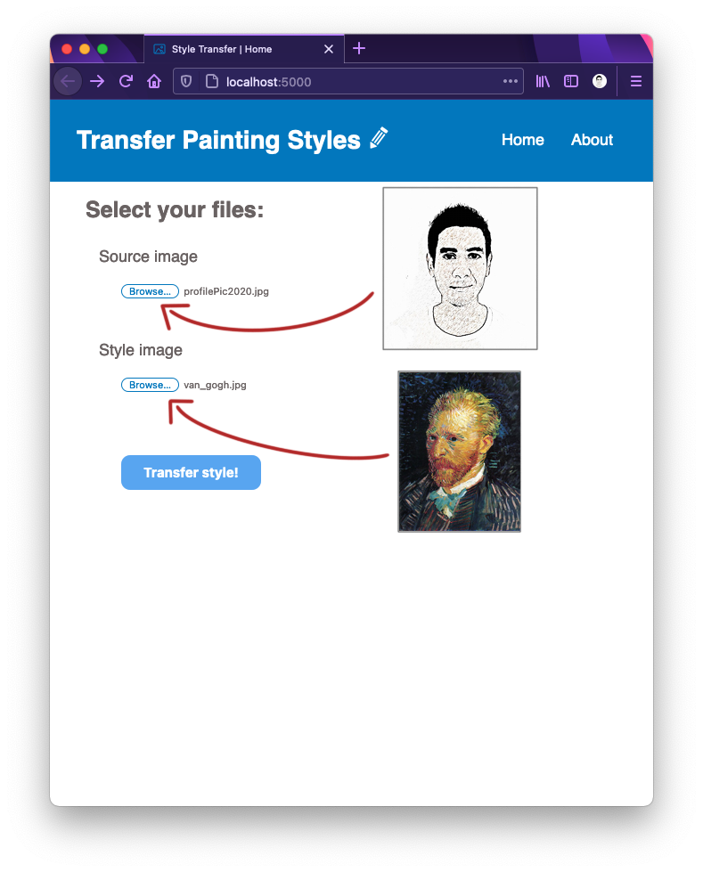
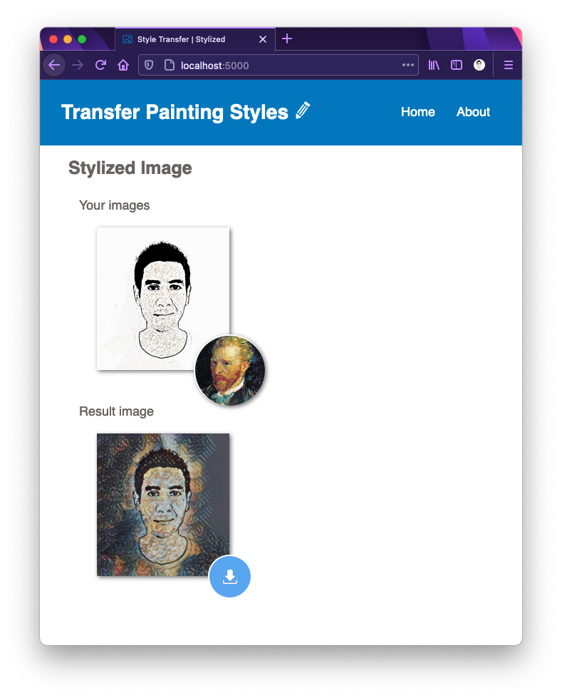

# StyleTransferApp

This app uses deep learning to compose one image using the style of another image.

This app uses docker to create two microservices, the first is a Tensorflow/Serving container aim to handle a Tensorflow DNN model that makes the style transfer. And, the second microservice is a Flask application that handles the web request and displays the results.

 

<h2>Interface</h2>

Some screenshots of the web app:

* Open your browser in localhost on port 5000 and you will see this page:

* Select a source and a style image to process. The program will mimic the style image into the source image:

* See the results and download them if you wish:

 

<h3>Notes</h3>

* The first time you compose up the services, it could take a few minutes since a DNN model is downloaded and a couple of python libraries are installed.
* The chace for the processed image can be found in <i style="color:MediumSeaGreen;">./python/static/temp/</i>. In case you want to re-visid the processed images or erase the files.
* For info about the DNN model, please visit: https://www.tensorflow.org/tutorials/generative/style_transfer 
